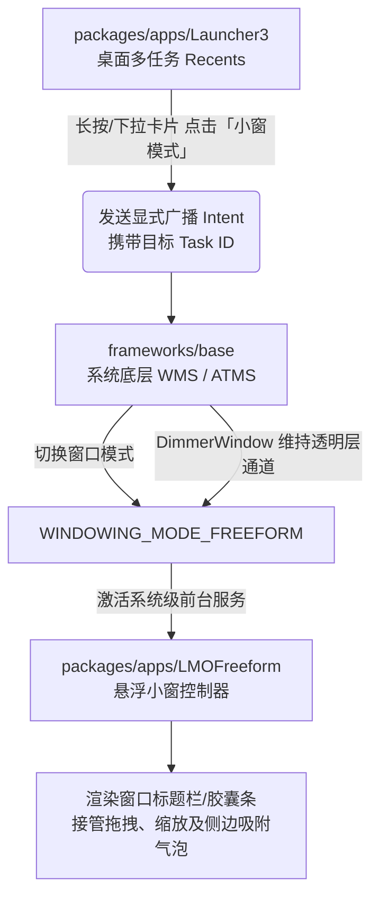

# Android 17 (API 37) 原生悬浮小窗套件集成指南

-3DDC84?logo=android&logoColor=white)


本项目是一套面向 **Android 17 (API 37)** 定制 ROM 的原生悬浮小窗（Mini Window / Freeform）完整解决方案。通过整合底层窗口管理服务、系统桌面多任务触发器以及前台悬浮控制器，为开源 AOSP 系统提供类商业 ROM 的多任务小窗交互体验。

---

## 🔗 核心组件仓库导航

本套件由三个深度协同的代码仓库组成：

| 模块类别 | 源码路径 | GitHub 仓库链接 | 核心职责 |
| :--- | :--- | :--- | :--- |
| **底层框架服务** | `frameworks/base` | [yokeshiq/frameworks_base](https://github.com/yokeshiq/frameworks_base) | WMS/ATMS 层级切换、小窗模式调度与 Dimmer 遮罩层修复 |
| **桌面与多任务** | `packages/apps/Launcher3` | [yokeshiq/packages_apps_Launcher3](https://github.com/yokeshiq/packages_apps_Launcher3) | 最近任务卡片小窗快捷入口、广播唤醒、SDK 37 依赖适配及中文本地化 |
| **悬浮窗控制器** | `packages/apps/LMOFreeform` | [yokeshiq/packages_apps_LMOFreeform](https://github.com/yokeshiq/packages_apps_LMOFreeform) | 前台悬浮容器、手势拖拽、双向拉伸缩放、贴边吸附气泡与状态栏装饰 |

---

## 🏗️ 架构协作流程



---

## 📦 各组件核心功能说明

### 1. 底层框架服务 (`frameworks/base`)
* **仓库地址**：[https://github.com/yokeshiq/frameworks_base](https://github.com/yokeshiq/frameworks_base)
* **目标分支**：`17`
* **关键变更**：
  * **窗口管理器调度增强 (`WindowManagerService` & `ATMS`)**：开放特定 Task 的 `WINDOWING_MODE_FREEFORM` 直接转换接口，允许系统特权组件拉起小窗；优化全屏/小窗状态切换，避免触发 Activity 重建导致数据丢失。
  * **状态修饰与遮罩层修复 (`DimmerWindow`)**：修复 `services/core/java/com/android/server/wm/DimmerWindow.java`，在窗口固定状态时接管 `enterPinnedWindowingMode()` 调用，消除缩放与拖拽时画面冻结、黑屏与残影问题。

### 2. 桌面与多任务模块 (`packages/apps/Launcher3`)
* **仓库地址**：[https://github.com/yokeshiq/packages_apps_Launcher3](https://github.com/yokeshiq/packages_apps_Launcher3)
* **目标分支**：`17`
* **关键变更**：
  * **多任务卡片操作入口 (Recents Task Action)**：在 `TaskMenuView` 的卡片操作弹窗中注入小窗选项，点击时自动构造携带目标应用 `taskId` 的系统广播。
  * **API 37 构建适配**：将 `Android.bp` 中的 `minSdkVersion` 提升至 `37`，解决 Android 17 上游引入最新版 `SettingsLib` 引发的编译兼容阻断。
  * **内置简体中文支持 (`values-zh-rCN`)**：补齐桌面 Quickspace 快捷信息、Google 智能镜头（Lens）以及 `quickstep/res` 中新增的 15 项全面屏手势教学与沙盒模式文案。

### 3. 小窗控制服务 (`packages/apps/LMOFreeform`)
* **仓库地址**：[https://github.com/yokeshiq/packages_apps_LMOFreeform](https://github.com/yokeshiq/packages_apps_LMOFreeform)
* **目标分支**：`17`
* **关键变更**：
  * **手势交互引擎**：按压顶部胶囊条/标题栏可在屏幕任意区域拖动；支持双指缩放及右下角对角边缘拉伸；向屏幕两侧滑出时自动收纳为半透明悬浮气泡。
  * **系统环境响应**：监听软键盘弹起事件自动抬升小窗纵向坐标，避让输入焦点；窗口边框采用 Material You 规范自动提取系统壁纸主题色。

---

## 🚀 全流程部署与编译指南

### 第一步：配置 Local Manifest

在 ROM 源码根目录下的 `.repo/local_manifests/freeform.xml` 文件中填入以下配置：

```xml
<?xml version="1.0" encoding="UTF-8"?>
<manifest>
  <!-- 1. 替换底层核心 frameworks/base -->
  <remove-project name="platform/frameworks/base" />
  <project path="frameworks/base" 
           name="yokeshiq/frameworks_base" 
           remote="github" 
           revision="17" />

  <!-- 2. 替换桌面与多任务 Launcher3 -->
  <remove-project name="platform/packages/apps/Launcher3" />
  <project path="packages/apps/Launcher3" 
           name="yokeshiq/packages_apps_Launcher3" 
           remote="github" 
           revision="17" />

  <!-- 3. 引入小窗控制器 LMOFreeform -->
  <project path="packages/apps/LMOFreeform" 
           name="yokeshiq/packages_apps_LMOFreeform" 
           remote="github" 
           revision="17" />
</manifest>
```

### 第二步：同步仓库分支

在源码根目录下执行强制同步命令：

```bash
repo sync -c -j$(nproc) --force-sync frameworks/base packages/apps/Launcher3 packages/apps/LMOFreeform
```

### 第三步：在编译配置中声明模块

在目标机型 Makefile（如 `device/xiaomi/munch/device.mk`）或 ROM 统一配置（如 `common.mk`）中添加该包：

```makefile
# 启用原生悬浮小窗控制器服务
PRODUCT_PACKAGES += \
    LMOFreeform
```

### 第四步：执行编译

**单模块独立编译验证（快速测试修改）：**

```bash
# 验证底层服务编译
mma frameworks/base -j$(nproc)

# 验证桌面与多任务模块
mma Launcher3QuickStep -j$(nproc)

# 验证小窗控制器
mma LMOFreeform -j$(nproc)
```

**ROM 全量构建打包：**

```bash
source build/envsetup.sh
lunch infinity_设备代号-userdebug
m bacon -j$(nproc)
```

---

## 🔍 功能验证与操作规范

刷入系统并启动后，按以下步骤验证功能：

1. **服务检查**：通过 ADB 检查控制服务是否正常集成：
   ```bash
   adb shell pm list packages | grep freeform
   ```
2. **多任务唤起**：打开任意应用，上滑停顿进入多任务视图（Recents），长按应用卡片，检查菜单中是否出现**「小窗模式」**选项。
3. **交互手势测试**：
   * **拖拽**：轻触顶部胶囊栏并在屏幕内移动，松手后位置固定。
   * **缩放**：长按小窗对角边缘拉伸，确认画面自适应缩放无残影。
   * **贴边收起**：将小窗快速拖拽至屏幕左右边缘，验证是否自动收缩为悬浮气泡。
   * **键盘避让**：在小窗内点击输入框，验证小窗是否向上平移避让输入法键盘。

---

## 📄 许可证

本项目遵循 [Apache License 2.0](http://www.apache.org/licenses/LICENSE-2.0) 开源协议。
